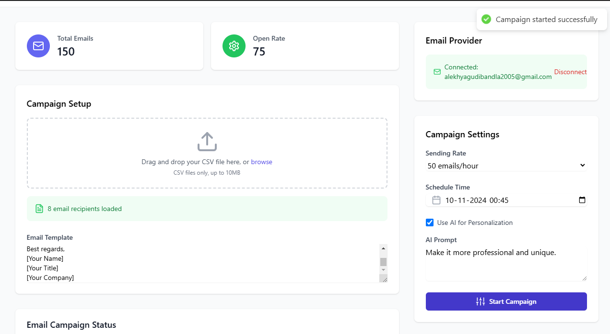

# Custom Email Sender Application

Welcome to the **Custom Email Sender Application**! This powerful tool allows you to efficiently send personalized emails in bulk, integrate with popular email service providers (ESP), and track email delivery—all through a user-friendly front-end dashboard. Developed as a skills assessment in machine learning, API integration, and user interface design, this project demonstrates a robust and practical solution for email automation.



## Key Features

- **Data Input**: Easily connect to Google Sheets or upload CSV files to manage email recipient data.
- **Email Customization**: Personalize each email with customizable prompts using placeholders like `{Company Name}`, `{Location}`, and more.
- **Scheduling & Throttling**: Schedule email sends for later, and control the sending rate to prevent overwhelming email servers or hitting rate limits.
- **Analytics Dashboard**: Gain real-time insights into your email sends, with status updates for sent, pending, and failed emails. Stay on top of your email campaign with delivery tracking.
- **ESP Integration**: Supports integration with popular ESPs like **SendGrid**, **Amazon SES**, and **Mailgun** for email delivery and status tracking.

## Setup and Usage

To get started with the **Custom Email Sender Application**, follow the simple steps below:

1. **Clone the Repository**:
    ```bash
    git clone <repository-url>
    ```

2. **Install Dependencies**:
    Navigate into the project directory and run:
    ```bash
    npm install
    ```

3. **Configure**:
    Add environment variables for the following:
    - Your **database** connection.
    - ESP API key for your chosen service (SendGrid, Amazon SES, or Mailgun).
    - LLM (Large Language Model) access for email prompt customization.

4. **Run the Application**:
    Launch the app by running:
    ```bash
    npm start
    ```

Once the application is running, you can start sending personalized emails, scheduling campaigns, and tracking your email deliverability right from the dashboard.

## Contributing

Feel free to contribute to this project! Whether it's adding new features, improving the UI/UX, or fixing bugs, your contributions are welcome.

---
